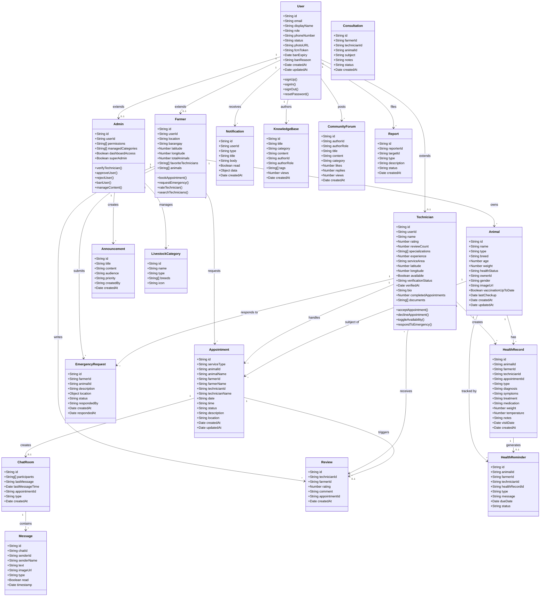
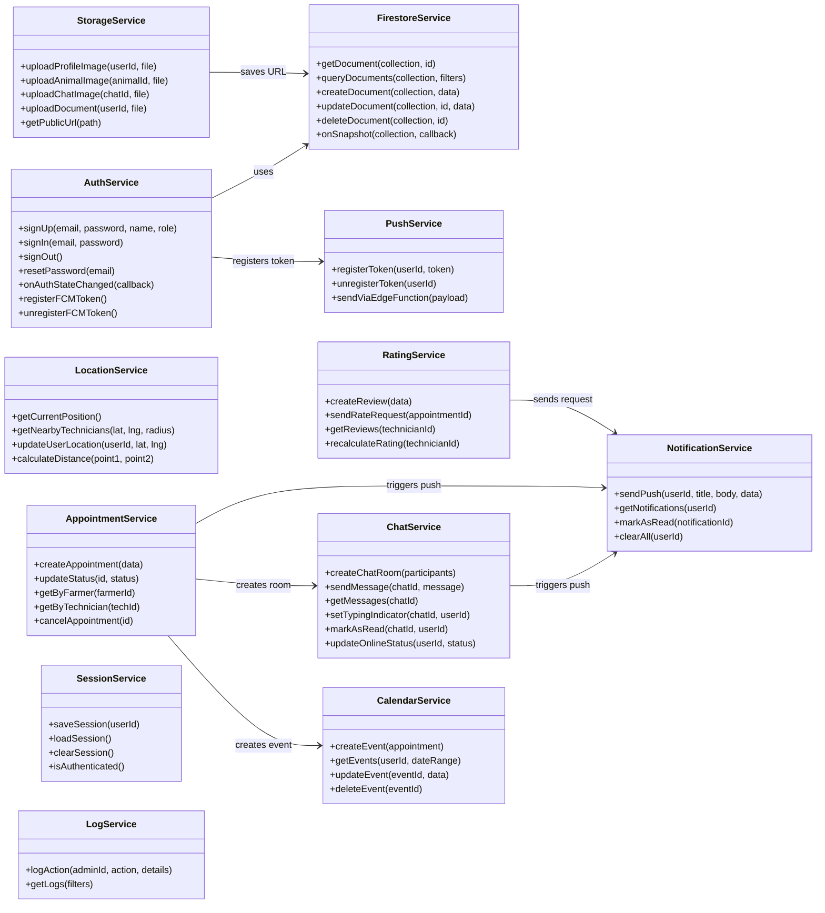

# 📐 AgriCare — Class Diagram

> Mga pangunahing classes/models ng AgriCare system at kanilang relationships.

---

## Complete Class Diagram

```mermaid
classDiagram
    direction TB

    class User {
        +String id
        +String email
        +String displayName
        +String role
        +String phoneNumber
        +String status
        +String photoURL
        +String fcmToken
        +Date banExpiry
        +String banReason
        +Date createdAt
        +Date updatedAt
        +signUp()
        +signIn()
        +signOut()
        +resetPassword()
    }

    class Admin {
        +String id
        +String userId
        +String[] permissions
        +String[] managedCategories
        +Boolean dashboardAccess
        +Boolean superAdmin
        +verifyTechnician()
        +approveUser()
        +rejectUser()
        +banUser()
        +manageContent()
    }

    class Farmer {
        +String id
        +String userId
        +String location
        +String barangay
        +Number latitude
        +Number longitude
        +Number totalAnimals
        +String[] favoriteTechnicians
        +String[] animals
        +bookAppointment()
        +requestEmergency()
        +rateTechnician()
        +searchTechnicians()
    }

    class Technician {
        +String id
        +String userId
        +String name
        +Number rating
        +Number reviewCount
        +String[] specializations
        +Number experience
        +String serviceArea
        +Number latitude
        +Number longitude
        +Boolean available
        +String verificationStatus
        +Date verifiedAt
        +String bio
        +Number completedAppointments
        +String[] documents
        +acceptAppointment()
        +declineAppointment()
        +toggleAvailability()
        +respondToEmergency()
    }

    class Animal {
        +String id
        +String name
        +String type
        +String breed
        +Number age
        +Number weight
        +String healthStatus
        +String ownerId
        +String gender
        +String imageUrl
        +Boolean vaccinationUpToDate
        +Date lastCheckup
        +Date createdAt
        +Date updatedAt
    }

    class Appointment {
        +String id
        +String serviceType
        +String animalId
        +String animalName
        +String farmerId
        +String farmerName
        +String technicianId
        +String technicianName
        +String date
        +String time
        +String status
        +String description
        +String location
        +Date createdAt
        +Date updatedAt
    }

    class Consultation {
        +String id
        +String farmerId
        +String technicianId
        +String animalId
        +String subject
        +String notes
        +String status
        +Date createdAt
    }

    class EmergencyRequest {
        +String id
        +String farmerId
        +String animalId
        +String description
        +Object location
        +String status
        +String respondedBy
        +Date createdAt
        +Date respondedAt
    }

    class HealthRecord {
        +String id
        +String animalId
        +String farmerId
        +String technicianId
        +String appointmentId
        +String type
        +String diagnosis
        +String symptoms
        +String treatment
        +String medication
        +Number weight
        +Number temperature
        +String notes
        +Date visitDate
        +Date createdAt
    }

    class ChatRoom {
        +String id
        +String[] participants
        +String lastMessage
        +Date lastMessageTime
        +String appointmentId
        +String type
        +Date createdAt
    }

    class Message {
        +String id
        +String chatId
        +String senderId
        +String senderName
        +String text
        +String imageUrl
        +String type
        +Boolean read
        +Date timestamp
    }

    class Notification {
        +String id
        +String userId
        +String type
        +String title
        +String body
        +Boolean read
        +Object data
        +Date createdAt
    }

    class KnowledgeBase {
        +String id
        +String title
        +String category
        +String content
        +String authorId
        +String authorRole
        +String[] tags
        +Number views
        +Date createdAt
    }

    class CommunityForum {
        +String id
        +String authorId
        +String authorRole
        +String title
        +String content
        +String category
        +Number likes
        +Number replies
        +Number views
        +Date createdAt
    }

    class Review {
        +String id
        +String technicianId
        +String farmerId
        +Number rating
        +String comment
        +String appointmentId
        +Date createdAt
    }

    class Report {
        +String id
        +String reporterId
        +String targetId
        +String type
        +String description
        +String status
        +Date createdAt
    }

    class Announcement {
        +String id
        +String title
        +String content
        +String audience
        +String priority
        +String createdBy
        +Date createdAt
    }

    class LivestockCategory {
        +String id
        +String name
        +String type
        +String[] breeds
        +String icon
    }

    class HealthReminder {
        +String id
        +String animalId
        +String farmerId
        +String technicianId
        +String healthRecordId
        +String type
        +String message
        +Date dueDate
        +String status
    }

    %% Relationships
    User "1" --> "0..1" Admin : extends
    User "1" --> "0..1" Farmer : extends
    User "1" --> "0..1" Technician : extends

    Farmer "1" --> "*" Animal : owns
    Farmer "1" --> "*" Appointment : requests
    Farmer "1" --> "*" EmergencyRequest : submits
    Farmer "1" --> "*" Review : writes

    Technician "1" --> "*" Appointment : handles
    Technician "1" --> "*" EmergencyRequest : responds to
    Technician "1" --> "*" HealthRecord : creates
    Technician "*" --> "*" Review : receives

    Animal "1" --> "*" Appointment : subject of
    Animal "1" --> "*" HealthRecord : has
    Animal "1" --> "*" HealthReminder : tracked by

    Appointment "1" --> "0..1" ChatRoom : creates
    Appointment "1" --> "0..1" Review : triggers

    ChatRoom "1" --> "*" Message : contains

    User "1" --> "*" Notification : receives
    User "1" --> "*" KnowledgeBase : authors
    User "1" --> "*" CommunityForum : posts
    User "1" --> "*" Report : files

    Admin "1" --> "*" Announcement : creates
    Admin "1" --> "*" LivestockCategory : manages

    HealthRecord "1" --> "0..1" HealthReminder : generates
```

---

## Service Layer Classes

```mermaid
classDiagram
    direction LR

    class AuthService {
        +signUp(email, password, name, role)
        +signIn(email, password)
        +signOut()
        +resetPassword(email)
        +onAuthStateChanged(callback)
        +registerFCMToken()
        +unregisterFCMToken()
    }

    class FirestoreService {
        +getDocument(collection, id)
        +queryDocuments(collection, filters)
        +createDocument(collection, data)
        +updateDocument(collection, id, data)
        +deleteDocument(collection, id)
        +onSnapshot(collection, callback)
    }

    class ChatService {
        +createChatRoom(participants)
        +sendMessage(chatId, message)
        +getMessages(chatId)
        +setTypingIndicator(chatId, userId)
        +markAsRead(chatId, userId)
        +updateOnlineStatus(userId, status)
    }

    class NotificationService {
        +sendPush(userId, title, body, data)
        +getNotifications(userId)
        +markAsRead(notificationId)
        +clearAll(userId)
    }

    class AppointmentService {
        +createAppointment(data)
        +updateStatus(id, status)
        +getByFarmer(farmerId)
        +getByTechnician(techId)
        +cancelAppointment(id)
    }

    class LocationService {
        +getCurrentPosition()
        +getNearbyTechnicians(lat, lng, radius)
        +updateUserLocation(userId, lat, lng)
        +calculateDistance(point1, point2)
    }

    class StorageService {
        +uploadProfileImage(userId, file)
        +uploadAnimalImage(animalId, file)
        +uploadChatImage(chatId, file)
        +uploadDocument(userId, file)
        +getPublicUrl(path)
    }

    class RatingService {
        +createReview(data)
        +sendRateRequest(appointmentId)
        +getReviews(technicianId)
        +recalculateRating(technicianId)
    }

    class PushService {
        +registerToken(userId, token)
        +unregisterToken(userId)
        +sendViaEdgeFunction(payload)
    }

    class SessionService {
        +saveSession(userId)
        +loadSession()
        +clearSession()
        +isAuthenticated()
    }

    class CalendarService {
        +createEvent(appointment)
        +getEvents(userId, dateRange)
        +updateEvent(eventId, data)
        +deleteEvent(eventId)
    }

    class LogService {
        +logAction(adminId, action, details)
        +getLogs(filters)
    }

    AuthService --> FirestoreService : uses
    AuthService --> PushService : registers token
    ChatService --> NotificationService : triggers push
    AppointmentService --> NotificationService : triggers push
    AppointmentService --> ChatService : creates room
    AppointmentService --> CalendarService : creates event
    RatingService --> NotificationService : sends request
    StorageService --> FirestoreService : saves URL
```
